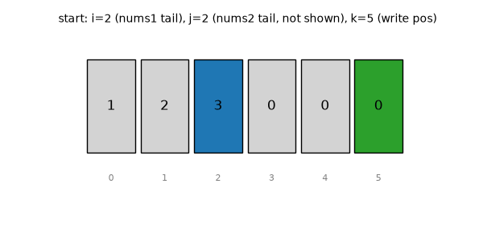

# Merge Sorted Array (LeetCode #88)

## Problem Statement
Given two sorted integer arrays `nums1` and `nums2`, merge `nums2` into `nums1` as one sorted array, in place.
`nums1` has length `m + n`: the first `m` elements are the real data, the last `n` are `0` placeholders reserved for `nums2`'s elements.

## Constraints
- `nums1.length == m + n`, `nums2.length == n`
- Both `nums1[:m]` and `nums2` are sorted ascending
- `0 <= m, n`

## Intuition
Merging from the front needs a temp array, because writing into `nums1[0..]` would overwrite values not yet read. Merging from the **back** avoids this: the tail of `nums1` (positions `m..m+n-1`) is empty placeholder space, so we can safely write the largest remaining value there without destroying unread data.

## Approach
1. `i = m - 1` (last real element of `nums1`), `j = n - 1` (last element of `nums2`), `k = m + n - 1` (write pointer, from the back).
2. While `j >= 0`: compare `nums1[i]` and `nums2[j]`. Place the **larger** at `nums1[k]`, decrement that source pointer and `k`.
3. If `i` runs out first, remaining `nums2` values are simply copied down (they're already the smallest remaining).
4. Stop when `j < 0` — everything from `nums2` has been placed.

## Diagram


Blue = `i` (nums1 pointer), Green = `k` (write pointer). `j` (nums2 pointer) isn't a `nums1` index, so it's called out in each frame's caption instead.

## Complexity
- Time: O(m + n)
- Space: O(1) — merges in place

## Code
See [`solution.py`](./solution.py).

```python
def merge(nums1, m, nums2, n):
    i, j, k = m - 1, n - 1, m + n - 1
    while j >= 0:
        if i >= 0 and nums1[i] > nums2[j]:
            nums1[k] = nums1[i]
            i -= 1
        else:
            nums1[k] = nums2[j]
            j -= 1
        k -= 1
    return nums1
```

## Test Cases
| Input | Expected Output | Notes |
|-------|------------------|-------|
| `nums1=[1,2,3,0,0,0], m=3, nums2=[2,5,6], n=3` | `[1,2,2,3,5,6]` | normal case |
| `nums1=[1], m=1, nums2=[], n=0` | `[1]` | nums2 empty |
| `nums1=[0], m=0, nums2=[1], n=1` | `[1]` | nums1 empty |

Regenerate the diagram with:
```
python topics/array/merge-sorted-array/generate_gif.py
```
